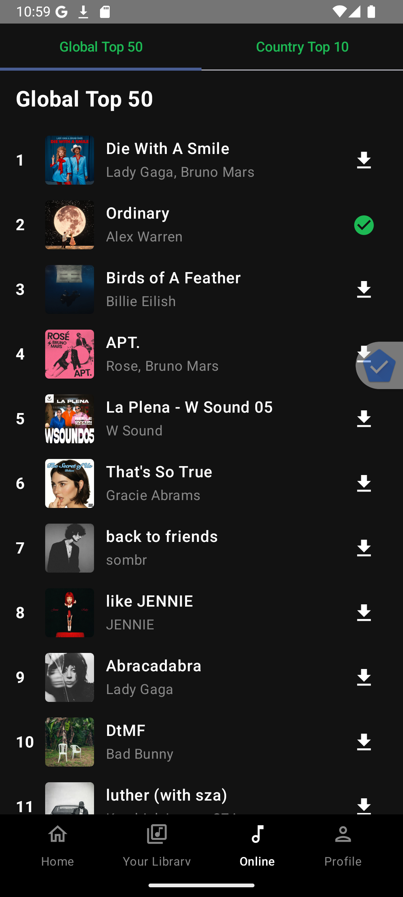
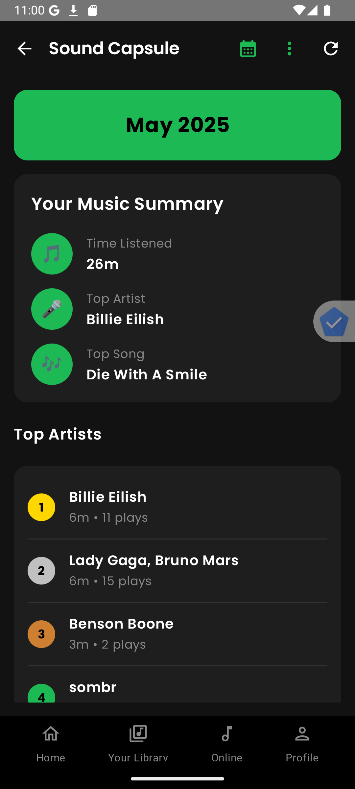
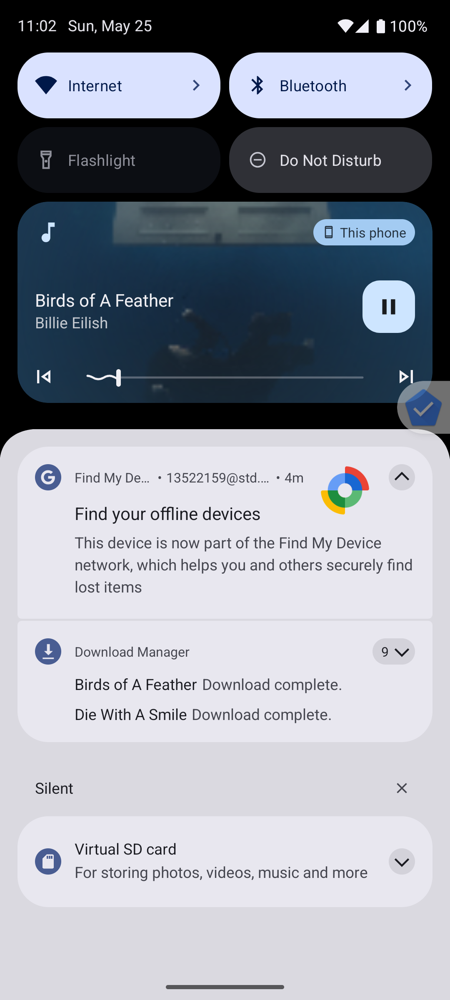
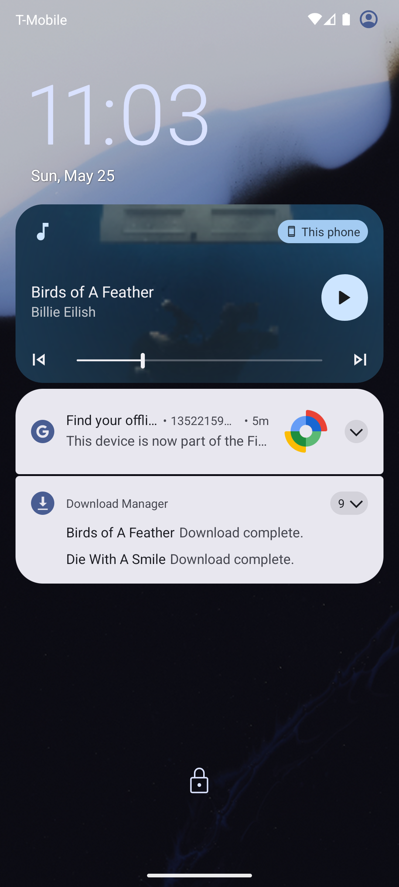
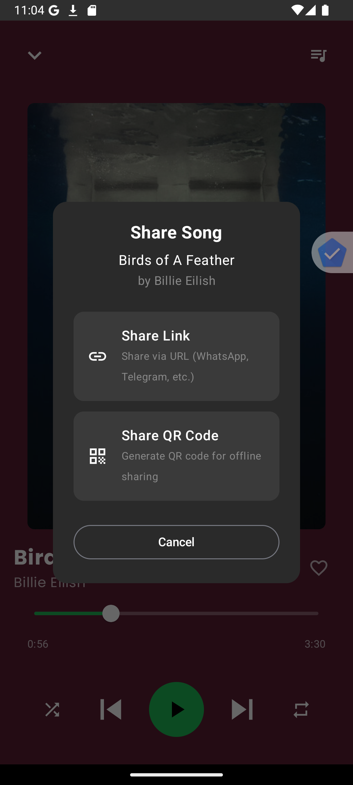
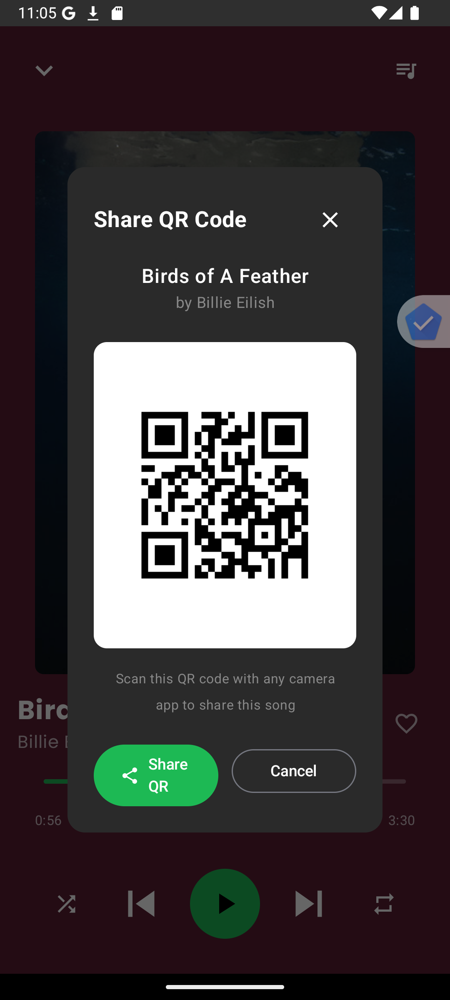
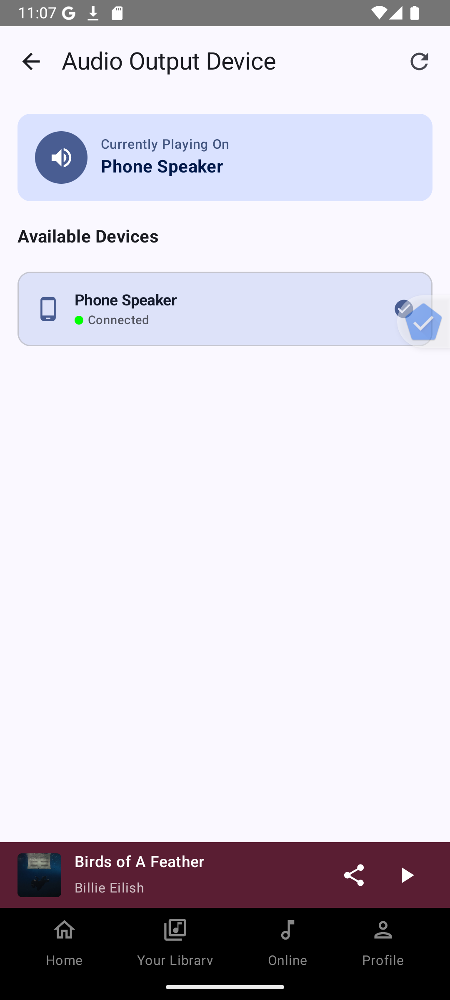
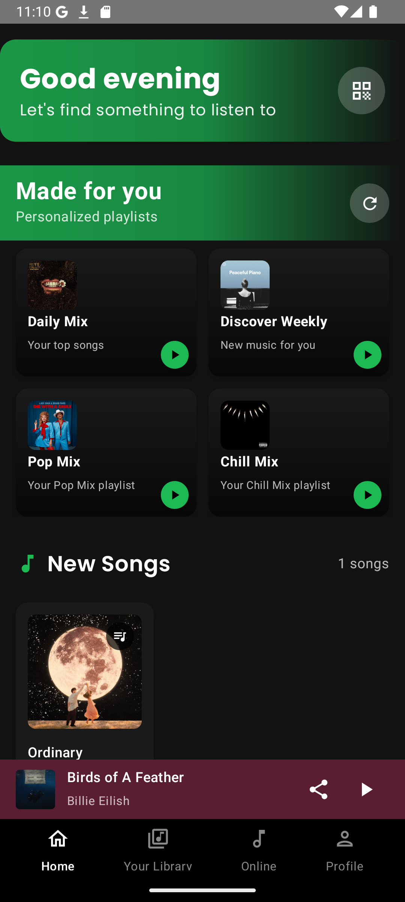
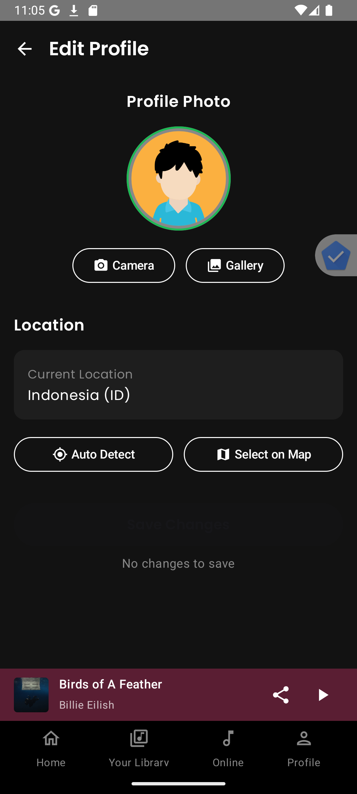

# 🎵 Purrytify – Android Music App

## 📱 1. Deskripsi Aplikasi

Purrytify adalah aplikasi pemutar musik berbasis Android Native (Kotlin). Aplikasi ini memungkinkan pengguna untuk login, menambahkan dan memutar lagu, menyukai lagu, melihat profil, serta menikmati musik dengan pengalaman yang modern dan nyaman. Dengan detail dari fitur-fitur aplikasi ini ada dibawah ini.

- Login dan Logout dengan token JWT
- Pemutaran lagu dari storage pengguna
- Library dan Liked Songs
- Fitur Now Playing dengan Mini Player
- Tambah/Edit/Hapus lagu dari storage
- Deteksi dan refresh token JWT secara otomatis
- Deteksi status koneksi internet (network sensing)
- Menampilkan informasi profil pengguna
- Background Service untuk token validation
- Online Songs
- Download Online Songs
- Sound Capsule (Analytics) & Export
- Notification Controls
- AudioRouting and Output Device
- Share Songs via URL
- Share Songs via QR
- Rekomendasi Lagu
- Edit Profile

---

## 📚 2. Library yang Digunakan

### ⚙️ Android Core & Jetpack
- **Jetpack Compose** (`material3`, `ui`, `navigation`, `lifecycle`)
   - Material Design 3 components
   - UI toolkit modern untuk Android
   - Navigation component untuk Compose
   - Lifecycle-aware components
- **Room Database** (v2.5.2) - Local database untuk metadata lagu
- **ConstraintLayout** (v2.2.1) - Layout manager untuk UI kompleks
- **DataStore Preferences** - Modern replacement untuk SharedPreferences
- **ViewModel, LiveData, StateFlow, SharedFlow** - Reactive programming dan state management
- **Core KTX** (v1.12.0) - Kotlin extensions untuk Android
- **Activity & Fragment KTX** - Kotlin extensions untuk Activity dan Fragment lifecycle

### 🌐 Networking & Authentication
- **Retrofit** + **Gson Converter** - REST API client dengan JSON parsing
- **OkHttp** (v4.12.0) + **Logging Interceptor** - HTTP client dengan logging capability
- **Security Crypto** - EncryptedSharedPreferences untuk secure token storage
- **Volley** - Alternative networking library untuk operasi tertentu

### 🎵 Media & Image Loading
- **Coil** (v2.4.0) - Modern image loading library
   - Support untuk SVG dan video thumbnails
   - Compose integration
- **Glide** (v4.15.1) - Image loading and caching
- **MediaMetadataRetriever** - Extract metadata dari file audio
- **Media Compat** (v1.7.0) - Media framework compatibility

### 🧭 Navigation & UI Components
- **Navigation Compose** - Type-safe navigation untuk Jetpack Compose
- **Core Splashscreen** - Modern splash screen implementation
- **Accompanist SwipeRefresh** (v0.25.1) - Pull-to-refresh gesture
- **Material Icons Extended** - Extended icon set untuk Material Design
- **RecyclerView** (v1.3.0) - Efficient list display
- **Legacy Support** - Backward compatibility support

### 📱 Device Features & Permissions
- **CameraX** (v1.3.0) - Modern camera API
   - Camera Core, Camera2, Lifecycle, View
- **ML Kit Barcode Scanning** (v17.2.0) - QR code scanning capability
- **ZXing** - QR code generation dan scanning
   - Core (v3.5.1) untuk QR generation
   - Android Embedded (v4.3.0) untuk scanning UI
- **Google Play Services**
   - Location services (v21.0.1) - GPS dan location tracking
   - Maps (v18.2.0) - Google Maps integration
   - Places API (v3.3.0) - Places autocomplete dan search
- **Accompanist Permissions** (v0.32.0) - Runtime permissions handling

### ⚙️ Background Processing & Services
- **Work Manager** (v2.9.0) - Background task scheduling
- **Coroutines** (v1.7.3) - Asynchronous programming
   - Core dan Android extensions
- **LocalBroadcastManager** - Inter-component communication
- **Lifecycle Process** - Process lifecycle awareness

### 🛠️ Development & Testing
- **JUnit** - Unit testing framework
- **Espresso** - UI testing framework
- **Compose UI Testing** - Testing untuk Compose components
- **UI Tooling** - Development tools untuk Compose preview

### 📁 File & Utilities
- **Commons IO** (v2.11.0) - File operation utilities
- **AppCompat** (v1.6.1) - Backward compatibility untuk modern features

### 🏗️ Build Configuration
- **Compose BOM** (2024.02.02) - Bill of Materials untuk Compose versions
- **Kotlin Annotation Processing** (KAPT) - Annotation processing untuk Room compiler

### 🔧 Architecture Pattern
Aplikasi ini menggunakan **MVVM (Model-View-ViewModel)** architecture pattern dengan:
- **Repository Pattern** untuk data layer abstraction
- **Dependency Injection** manual atau dengan Hilt/Dagger
- **Reactive Programming** dengan StateFlow dan LiveData
- **Clean Architecture** principles untuk separation of concerns

---

## 🖼️ 3. Screenshot Aplikasi

Berikut adalah halaman yang tersedia dari aplikasi ini:
- Halaman Login <br> 
- Home Screen <br> 
- Library dengan liked songs dan all songs <br> 
- Music Player <br> 
- Profile User <br> 
- Online Songs <br> 
- Sound Capsule <br> 
- Notification Controls <br> 
- Notification from lockscreen <br> 
- Share Songs via URL <br> 
- Share Songs via QR <br> 
- audio routing <br> 
- Rekomendasi Lagu <br> 
- Sound Capsule Analytics <br> 
- Edit Profile <br> 

---

## 👥 4. Pembagian Kerja Anggota Kelompok

| Nama | NIM | Tugas                                                                                                                                           |
|------|-----|-------------------------------------------------------------------------------------------------------------------------------------------------|
| Farhan Raditya Aji | 13522142 | Header dan Navbar, Login Logout, Home, Background service, Network Sensing, Edit Profile, Audio Routing                                         |
| M. Zaidan Sa'dun Robbani | 13522146 | Profil, liked songs, player, informasi lagu yang ditampilkan, queue, shuffle, repeat, pencarian, Rekomendasi lagu, Online Songs, Donwload Songs |
| Rafif Ardhinto Ichwantoro | 13522159 | library, add song, database song, mini player, queue, music player service, Song Capsule, Notificaiton control, share                           |

---

## ⏱️ 5. Waktu Pengerjaan

| Nama | NIM | Persiapan (jam) | Pengerjaan (jam) | Total      |
|------|-----|-----------------|------------------|------------|
| Farhan Raditya Aji | 13522142 | 8 jam | 70 jam           | **78 jam** |
| M. Zaidan Sa'dun Robbani | 13522146 | 3 jam | 80               | **83 jam** |
| Rafif Ardhinto Ichwantoro | 13522159 | 3 jam | 75 jam           | **78 jam** |

---


# Bonus OWASP Security Analysis & Implementation

## M4: Insufficient Input/Output Validation

### Kerentanan yang Ditemukan
- Upload file tanpa validasi tipe, ukuran, dan konten
- Login tanpa validasi format email dan panjang password
- Metadata lagu (judul, artis) tanpa validasi

### Perbaikan yang Dilakukan
- Menambahkan validasi MIME type dan ukuran file saat upload
- Implementasi validasi format email dan password minimum 6 karakter
- Validasi judul dan artis (tidak boleh kosong, maksimum 100 karakter)
- Sanitasi nama file untuk mencegah path traversal

```kotlin
// Contoh validasi upload file
private fun validateAudioFile(uri: Uri): Boolean {
    val mimeType = contentResolver.getType(uri)
    if (mimeType == null || !mimeType.startsWith("audio/")) {
        return false
    }
    val fileSize = contentResolver.openAssetFileDescriptor(uri, "r")?.length ?: 0
    if (fileSize > 50 * 1024 * 1024) { // Max 50MB
        return false
    }
    return true
}
```

## M8: Security Misconfiguration

### Kerentanan yang Ditemukan
- Penggunaan HTTP untuk komunikasi API (rentan MITM)
- Logging informasi sensitif (token) tanpa filter
- Tidak ada network security config
- Potensi debug mode aktif di produksi

### Perbaikan yang Dilakukan
- Beralih dari HTTP ke HTTPS untuk komunikasi server
- Membuat utility class LogUtils untuk logging aman tanpa data sensitif
- Implementasi network_security_config.xml
- Mematikan debug mode di build produksi

```xml
<!-- network_security_config.xml -->
<?xml version="1.0" encoding="utf-8"?>
<network-security-config>
    <domain-config cleartextTrafficPermitted="false">
        <domain includeSubdomains="true">34.101.226.132</domain>
    </domain-config>
</network-security-config>
```

## M9: Insecure Data Storage

### Kerentanan yang Ditemukan
- Database Room tanpa enkripsi
- File audio dan artwork disimpan tanpa enkripsi
- Tidak ada deteksi perangkat root
- Tidak ada timeout session

### Perbaikan yang Dilakukan
- Mengenkripsi database dengan SQLCipher
- Implementasi deteksi perangkat root
- Menambahkan session timeout (logout otomatis setelah 30 menit tidak aktif)
- Menambahkan FLAG_SECURE untuk mencegah screenshot layar sensitif

```kotlin
// Contoh enkripsi database
val instance = Room.databaseBuilder(context, AppDatabase::class.java, "purrytify_database")
    .openHelperFactory(SupportFactory("secure_password_key".toByteArray()))
    .build()

// Contoh deteksi root
fun isDeviceRooted(): Boolean {
    val paths = arrayOf("/system/app/Superuser.apk", "/sbin/su", "/system/bin/su")
    for (path in paths) {
        if (File(path).exists()) return true
    }
    return false
}
```

## Pengujian

Pengujian dilakukan untuk memastikan perbaikan keamanan berfungsi dengan baik:

1. Validasi input:
   - Mencoba upload file bukan audio → Berhasil ditolak
   - Login dengan format email salah → Pesan error muncul

2. Konfigurasi keamanan:
   - Komunikasi dengan server menggunakan HTTPS → Berhasil
   - Tidak ada informasi sensitif di log → Berhasil

3. Penyimpanan data:
   - Database terenkripsi → Berhasil
   - Aplikasi mendeteksi perangkat root → Berhasil
   - Session timeout berfungsi → Berhasil


Dengan perbaikan ini, aplikasi Purrytify menjadi lebih aman dari serangan yang umum terjadi pada aplikasi mobile, terutama yang berhubungan dengan validasi input, konfigurasi keamanan, dan penyimpanan data.
