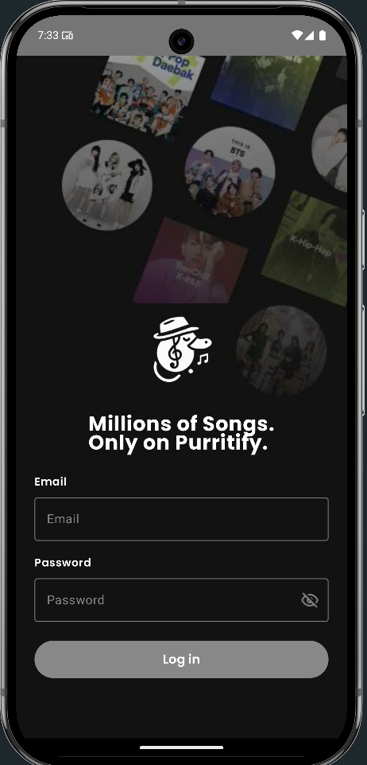
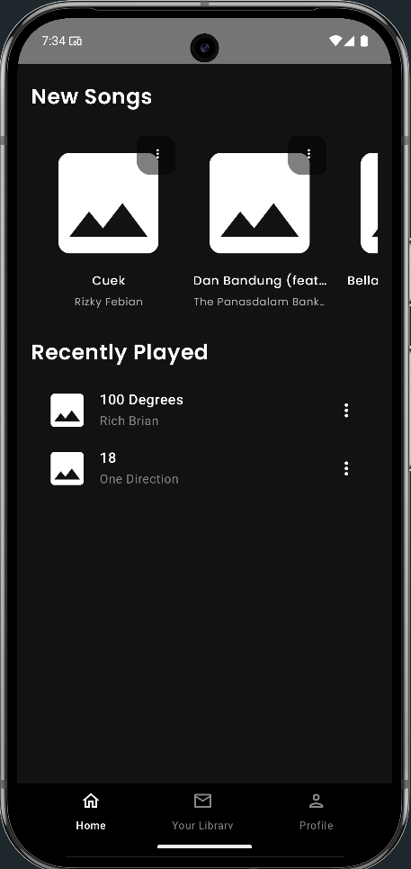
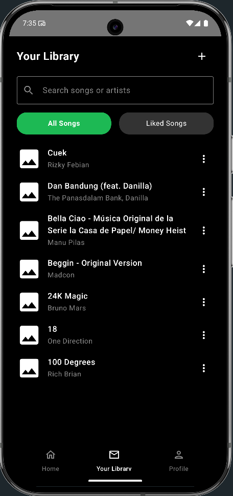
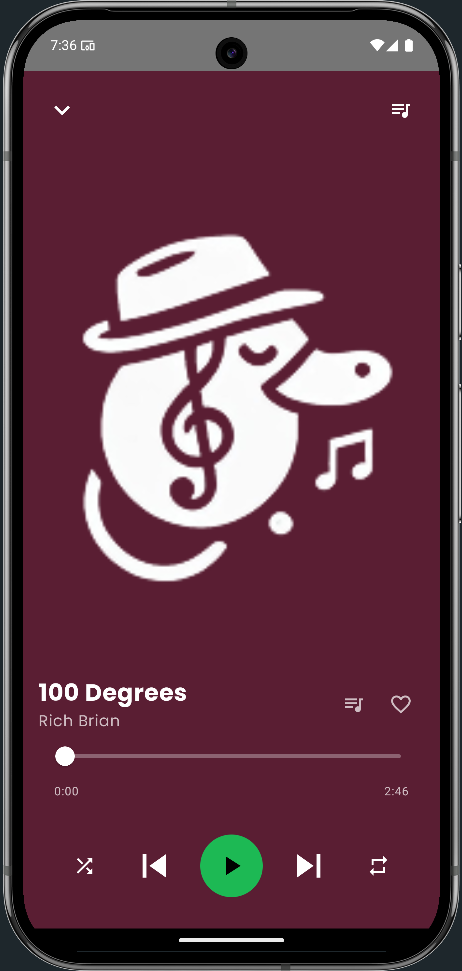
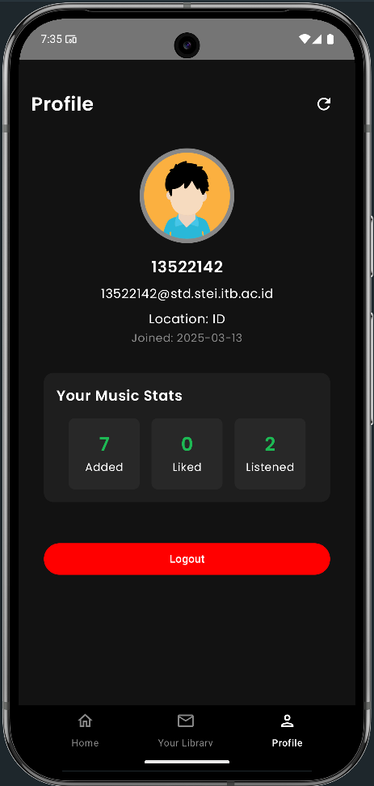

# 🎵 Purrytify – Android Music App

## 📱 1. Deskripsi Aplikasi

Purrytify adalah aplikasi pemutar musik berbasis Android Native (Kotlin). Aplikasi ini memungkinkan pengguna untuk login, menambahkan dan memutar lagu, menyukai lagu, melihat profil, serta menikmati musik dengan pengalaman yang modern dan nyaman. Dengan detail dari fitur-fitur aplikasi ini ada dibawah ini.

- Login dan Logout dengan token JWT
- Pemutaran lagu dari storage pengguna
- Library dan Liked Songs
- Fitur Now Playing dengan Mini Player
- Tambah/Edit/Hapus lagu dari storage
- Deteksi dan refresh token JWT secara otomatis
- Deteksi status koneksi internet (network sensing)
- Menampilkan informasi profil pengguna
- Background Service untuk token validation

---

## 📚 2. Library yang Digunakan

### ⚙️ Android Core & Jetpack
- Jetpack Compose (`material3`, `ui`, `navigation`, `lifecycle`)
- RecyclerView (untuk Library)
- Room (untuk database metadata lagu)
- DataStore (untuk penyimpanan data preferensi)
- ViewModel, LiveData, StateFlow, SharedFlow

### 🌐 Networking & Auth
- Retrofit + Gson Converter
- OkHttp + Logging Interceptor
- EncryptedSharedPreferences (Token Storage)

### 🎵 Media & UI
- Coil (load image cover)
- MediaMetadataRetriever (ambil info lagu)
- ConstraintLayout (untuk layout lama)
- Accompanist SwipeRefresh

### ⚙️ Background & Broadcast
- WorkManager (cek JWT token)
- LocalBroadcastManager (notifikasi internal)
- Coroutine (background execution)

---

## 🖼️ 3. Screenshot Aplikasi

Berikut adalah halaman yang tersedia dari aplikasi ini:
- Halaman Login   
- Home Screen   
- Library dengan liked songs dan all songs   
- Music Player   
- Profile User   

---

## 👥 4. Pembagian Kerja Anggota Kelompok

| Nama | NIM | Tugas |
|------|-----|-------|
| Farhan Raditya Aji | 13522142 | Header dan Navbar, Login Logout, Home, Background service, Network Sensing  |
| M. Zaidan Sa'dun Robbani | 13522146 |  |
| Rafif Ardhinto Ichwantoro | 13522159 |  |

---

## ⏱️ 5. Waktu Pengerjaan

| Nama | NIM | Persiapan (jam) | Pengerjaan (jam) | Total |
|------|-----|-----------------|------------------|-------|
| Farhan Raditya Aji | 13522142 | 8 jam | 35 jam | **43 jam** |
| M. Zaidan Sa'dun Robbani | 13522146 |  |  |  |
| Rafif Ardhinto Ichwantoro | 13522159 |  | |  |

---
